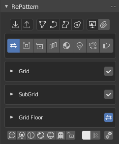
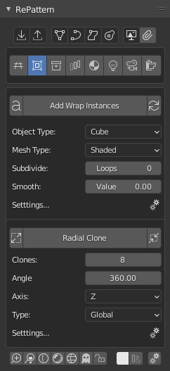
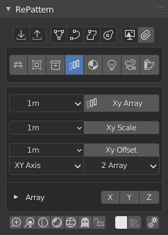
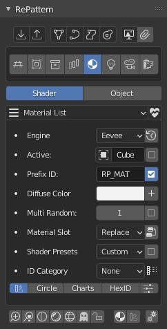
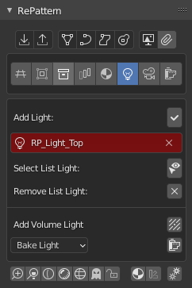
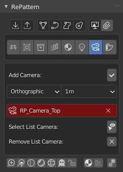
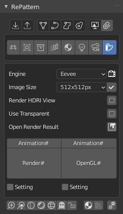

=========
RePattern
=========

Release Download : https://github.com/mkbreuer/view3d_repatternt/releases

``|``

.. contents:: Overview
   :depth: 2

``|``

------------
Introduction
------------

- set up for tileable mesh and texture pattern creation.
- work in progress
- ...

``|``

.......
Layouts
.......

.. image:: layout/03_wrap.png
   :height: 365
   :width: 242
   :alt: panel layout - wrap

An `example <http://example.com>`.

----

Support core Blender development: https://fund.blender.org  

